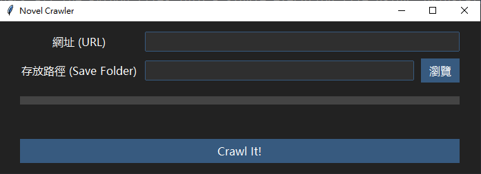

# Novel Crawler

This is a simple crawler for crawling novel from czbooks.net.



Given the url of the novel, we can crawl all the chapters and combine them into a single txt file placed in the folder you specify.

## Pack

To be convenient, we pack all the Python files into a single execution file using `pyinstaller`.

Run the below command to get the final execution file.

```shell
pyinstaller -F --noconsole main.py --name "Novel_Crawler"
```
